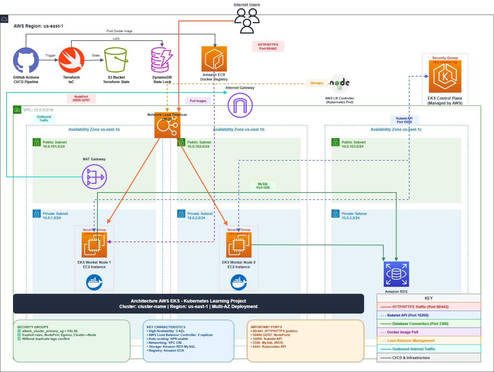

# Kubernetes Learning Project 🚀

A complete Infrastructure as Code (IaC) and CI/CD implementation using AWS EKS, Terraform, Docker, and GitHub Actions.

[Link to infrastructure repo](https://github.com/jrquinte/kubernetes-infrastructure)

## 📋 Table of Contents

- [Overview](#overview)
- [Architecture](#architecture)
- [Prerequisites](#prerequisites)
- [Project Structure](#project-structure)
- [Getting Started](#getting-started)
- [Deployment Guide](#deployment-guide)
- [CI/CD Pipeline](#cicd-pipeline)
- [Monitoring and Scaling](#monitoring-and-scaling)
- [Troubleshooting](#troubleshooting)
- [Clean Up](#clean-up)

## 🎯 Overview

This project demonstrates a production-ready Kubernetes setup on AWS EKS with:

- **Infrastructure as Code**: Terraform for AWS resource provisioning
- **Container Orchestration**: Kubernetes (EKS) for application deployment
- **CI/CD**: GitHub Actions for automated build and deployment
- **Scalability**: Horizontal Pod Autoscaler for automatic scaling
- **High Availability**: Multi-AZ deployment with load balancing
- **Security**: Private subnets, IAM roles, and ECR for image storage

## 🏗️ Architecture





## ✅ Prerequisites

### Required Tools

- **AWS CLI** (v2.x) - [Installation Guide](https://docs.aws.amazon.com/cli/latest/userguide/getting-started-install.html)
- **Terraform** (v1.6+) - [Installation Guide](https://learn.hashicorp.com/tutorials/terraform/install-cli)
- **kubectl** (v1.28+) - [Installation Guide](https://kubernetes.io/docs/tasks/tools/)
- **Docker** (v20+) - [Installation Guide](https://docs.docker.com/get-docker/)
- **Git** - [Installation Guide](https://git-scm.com/book/en/v2/Getting-Started-Installing-Git)

### AWS Account Setup

1. Create an AWS account if you don't have one
2. Create an IAM user with programmatic access
3. Attach the following AWS managed policies:
   - `AdministratorAccess` (for learning; use least privilege in production)
   
4. Configure AWS CLI:
```bash
aws configure
# Enter your AWS Access Key ID
# Enter your AWS Secret Access Key
# Default region: us-east-1
# Default output format: json
```

### GitHub Setup

1. Create two GitHub repositories:
   - `kubernetes-infrastructure` (for Terraform code)
   - `guestbook-app` (for application code)

2. Configure GitHub Secrets (in both repositories):
   - `AWS_ACCESS_KEY_ID`
   - `AWS_SECRET_ACCESS_KEY`

## 📁 Project Structure

```
kubernetes-project/
├── infrastructure/
│   ├── .github/
│   │   └── workflows/
│   │       └── terraform.yml
│   ├── scripts/
│   │   └── setup_terraform_backend.sh
│   ├── main.tf
│   ├── provider.tf
│   ├── variables.tf
│   ├── outputs.tf
│   └── README.md
│
└── application/
    ├── .github/
    │   └── workflows/
    │       └── deploy.yml
    ├── k8s/
    │   └── deployment.yaml
    ├── public/
    │   ├── index.html
    │   └── script.js
    ├── main.go
    ├── Dockerfile
    └── README.md
```

## 🚀 Getting Started

### Phase 1: Set Up Terraform Backend

The Terraform state needs to be stored remotely for team collaboration and safety.

```bash
# Navigate to infrastructure directory
cd infrastructure/scripts

# Make script executable
chmod +x setup_terraform_backend.sh

# Run the setup script
./setup_terraform_backend.sh
```

This creates:
- S3 bucket for Terraform state
- DynamoDB table for state locking
- Encryption and versioning enabled

### Phase 2: Deploy Infrastructure

#### Option A: Using Terraform CLI (Local)

```bash
cd infrastructure

# Initialize Terraform
terraform init

# Review the execution plan
terraform plan

# Apply the configuration
terraform apply

# Save outputs
terraform output > outputs.txt
```

#### Option B: Using GitHub Actions (Recommended)

1. Push code to `kubernetes-infrastructure` repository:
```bash
git init
git remote add origin https://github.com/YOUR_USERNAME/kubernetes-infrastructure.git
git add .
git commit -m "Initial infrastructure setup"
git push -u origin main
```

2. Go to **Actions** tab in GitHub
3. Select **Terraform EKS Infrastructure** workflow
4. Click **Run workflow**
5. Select action: `apply`

**Wait Time:** ~15-20 minutes for EKS cluster creation

### Phase 3: Configure kubectl

After infrastructure is deployed:

```bash
# Update kubeconfig to connect to EKS cluster
aws eks update-kubeconfig --region us-east-1 --name k8s-learning-cluster

# Verify connection
kubectl get nodes

# You should see 2 nodes in Ready state
```

### Phase 4: Deploy Application

#### Option A: Manual Deployment

```bash
cd application

# Build Docker image
docker build -t guestbook:v1 .

# Get ECR login password
aws ecr get-login-password --region us-east-1 | \
  docker login --username AWS --password-stdin \
  $(aws sts get-caller-identity --query Account --output text).dkr.ecr.us-east-1.amazonaws.com

# Tag image
docker tag guestbook:v1 \
  $(aws sts get-caller-identity --query Account --output text).dkr.ecr.us-east-1.amazonaws.com/k8s-learning/guestbook:v1

# Push to ECR
docker push \
  $(aws sts get-caller-identity --query Account --output text).dkr.ecr.us-east-1.amazonaws.com/k8s-learning/guestbook:v1

# Deploy to Kubernetes
export ECR_REGISTRY=$(aws sts get-caller-identity --query Account --output text).dkr.ecr.us-east-1.amazonaws.com
export IMAGE_TAG=v1
envsubst < k8s/deployment.yaml | kubectl apply -f -

# Check deployment status
kubectl rollout status deployment/guestbook

# Get LoadBalancer URL
kubectl get service guestbook
```

#### Option B: Using GitHub Actions (Recommended)

1. Push code to `guestbook-app` repository:
```bash
cd application
git init
git remote add origin https://github.com/YOUR_USERNAME/guestbook-app.git
git add .
git commit -m "Initial application setup"
git push -u origin main
```

2. GitHub Actions will automatically:
   - Build Docker image
   - Push to ECR
   - Deploy to EKS
   - Run health checks

### Phase 5: Access Your Application

```bash
# Get the LoadBalancer URL
kubectl get service guestbook -o jsonpath='{.status.loadBalancer.ingress[0].hostname}'

# Wait a minute for DNS propagation, then visit:
# http://[LOAD_BALANCER_URL]
```

## 🔄 CI/CD Pipeline

### Infrastructure Pipeline

**Trigger:** Push to `main` branch or manual workflow dispatch

**Steps:**
1. Checkout code
2. Configure AWS credentials
3. Run `terraform fmt` check
4. Initialize Terraform
5. Validate configuration
6. Generate execution plan
7. Apply changes (if approved)
8. Output cluster details

### Application Pipeline

**Development Branch (`develop`):**
- Build Docker image with `develop-{sha}` tag
- Push to ECR
- Deploy to development namespace
- No approval required

**Production Branch (`main`):**
- Build Docker image with `{sha}` and `latest` tags
- Push to ECR
- Deploy to production namespace (requires approval)
- Run smoke tests
- Report deployment status

## 📊 Monitoring and Scaling

### View Application Status

```bash
# Get all resources
kubectl get all -l app=guestbook

# View pod logs
kubectl logs -l app=guestbook --tail=50

# Describe deployment
kubectl describe deployment guestbook

# Check HPA status
kubectl get hpa guestbook-hpa
```

### Test Autoscaling

```bash
# Generate load to trigger autoscaling
kubectl run -i --tty load-generator --rm --image=busybox:1.36.0 --restart=Never -- /bin/sh -c "while sleep 0.01; do wget -q -O- http://guestbook; done"

# In another terminal, watch HPA
kubectl get hpa guestbook-hpa --watch

# You should see replicas increase based on CPU utilization
```

### Rolling Updates

```bash
# Update application (e.g., change image tag)
kubectl set image deployment/guestbook guestbook=NEW_IMAGE:NEW_TAG

# Watch rollout
kubectl rollout status deployment/guestbook

# View rollout history
kubectl rollout history deployment/guestbook

# Rollback if needed
kubectl rollout undo deployment/guestbook
```

## 🔧 Troubleshooting

### Common Issues

**1. Pods not starting**
```bash
# Check pod status
kubectl describe pod -l app=guestbook

# Common causes:
# - Image pull errors (check ECR permissions)
# - Resource limits too low
# - Health check failures
```

**2. LoadBalancer not getting external IP**
```bash
# Check service events
kubectl describe service guestbook

# Ensure security groups allow traffic
# Check VPC and subnet tags
```

**3. HPA not scaling**
```bash
# Ensure metrics-server is running
kubectl get deployment metrics-server -n kube-system

# Check if metrics are available
kubectl top nodes
kubectl top pods
```

**4. Terraform state lock**
```bash
# If deployment fails, force unlock
terraform force-unlock <LOCK_ID>

# Check DynamoDB table for stuck locks
aws dynamodb scan --table-name terraform-lock-k8s-learning-project
```

### Useful Commands

```bash
# Get cluster info
kubectl cluster-info

# Check node resources
kubectl describe nodes

# View all events
kubectl get events --sort-by='.lastTimestamp'

# Port forward for local testing
kubectl port-forward service/guestbook 8080:80

# Execute command in pod
kubectl exec -it <pod-name> -- /bin/sh

# View resource usage
kubectl top pods
kubectl top nodes
```

## 🧹 Clean Up

**Important:** Always clean up resources to avoid AWS charges!

### Delete Application

```bash
# Delete Kubernetes resources
kubectl delete -f k8s/deployment.yaml

# Or delete all guestbook resources
kubectl delete all -l app=guestbook
```

### Destroy Infrastructure

#### Option A: Using Terraform CLI

```bash
cd infrastructure
terraform destroy
```

#### Option B: Using GitHub Actions

1. Go to **Actions** tab
2. Select **Terraform EKS Infrastructure**
3. Click **Run workflow**
4. Select action: `destroy`

### Delete Backend Resources

```bash
# Delete S3 bucket (after destroying infrastructure)
aws s3 rb s3://terraform-state-k8s-learning-project --force

# Delete DynamoDB table
aws dynamodb delete-table --table-name terraform-lock-k8s-learning-project
```

## 📚 Learning Objectives

By completing this project, you will learn:

✅ **Infrastructure as Code**
- Terraform fundamentals and best practices
- AWS VPC, subnets, and networking concepts
- EKS cluster provisioning and configuration

✅ **Container Orchestration**
- Kubernetes Deployments, Services, and HPA
- Pod lifecycle and health checks
- Service discovery and load balancing

✅ **CI/CD**
- GitHub Actions workflows
- Docker multi-stage builds
- Automated testing and deployment

✅ **Cloud Security**
- IAM roles and policies
- Private subnets and NAT gateways
- ECR image security

✅ **DevOps Practices**
- GitOps workflow
- Infrastructure versioning
- Rollback strategies

## 🎓 Next Steps

To extend this project:

1. **Add Monitoring**
   - Set up Prometheus and Grafana
   - Implement CloudWatch metrics
   - Configure alerting

2. **Implement Redis**
   - Add Redis for session storage
   - Use ElastiCache for managed Redis
   - Update application to use Redis

3. **Add Ingress Controller**
   - Install AWS Load Balancer Controller
   - Configure Ingress resources
   - Set up SSL/TLS with ACM

4. **Implement GitOps**
   - Use ArgoCD or Flux
   - Automate application syncing
   - Implement progressive delivery

5. **Security Hardening**
   - Implement Pod Security Standards
   - Add Network Policies
   - Enable audit logging

## 📖 References

- [AWS EKS Best Practices](https://aws.github.io/aws-eks-best-practices/)
- [Terraform AWS Provider](https://registry.terraform.io/providers/hashicorp/aws/latest/docs)
- [Kubernetes Documentation](https://kubernetes.io/docs/home/)
- [Docker Best Practices](https://docs.docker.com/develop/dev-best-practices/)

## 📝 License

This project is for educational purposes. Feel free to use and modify as needed.

## 🤝 Contributing

Feel free to submit issues and enhancement requests!

---

**Happy Learning! 🚀**
